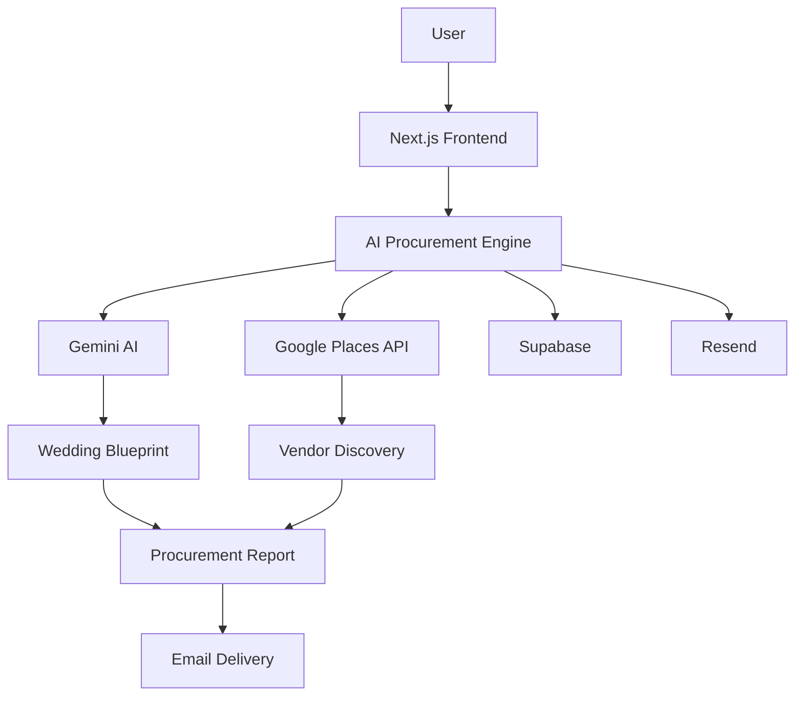

# 🎩 BargainBaba – AI Wedding Architect

### 💍 From Wedding Chaos to Wedding Intelligence

An AI-powered wedding procurement and planning platform that helps families discover vendors, optimize budgets, generate wedding blueprints, and make smarter wedding decisions.

---

## 🌟 The Problem

Wedding planning is one of the most expensive and stressful experiences for families.

People often struggle with:

* ❌ Vendor overpricing
* ❌ Lack of market transparency
* ❌ Endless vendor research
* ❌ Budget leakage
* ❌ Difficulty comparing vendors
* ❌ Generic planning advice

A single poor decision can significantly increase wedding expenses.

---

## 🚀 Our Solution

**BargainBaba** acts as an AI Wedding Architect.

Users simply provide:

* 📍 Wedding City
* 💰 Budget
* 👥 Guest Count
* 🪔 Religion & Community
* 🎯 Priorities

The platform then generates:

✅ Procurement Intelligence

✅ Real Vendor Discovery

✅ Budget Optimization

✅ Wedding Themes

✅ Market Intelligence

✅ Vendor Recommendations

✅ Cultural Blueprint

✅ Personalized Wedding Deliverables

✅ Automated Procurement Reports

---

## 🧠 Key Features

### 🤖 AI Wedding Architect

Generates personalized wedding blueprints using AI-powered procurement intelligence.

### 📍 Real Vendor Discovery

Discovers vendors using Google Places API and market data.

### 💰 Budget Optimization

Identifies savings opportunities and optimized budget allocations.

### 🎨 AI Wedding Themes

Creates wedding concepts tailored to budget, culture, and preferences.

### 🪔 Cultural Blueprint

Provides religion-aware and community-aware recommendations.

### 📊 Market Intelligence Dashboard

Displays:

* Average Market Cost
* Minimum Cost
* Vendor Insights
* Procurement Metrics

### ⚠️ Vendor Intelligence

Evaluates vendors using ratings, reviews, and procurement relevance.

### 📧 Automated Reports

Delivers procurement summaries and wedding blueprints directly to users.

---

## 🏗 System Architecture

---

## 🛠 Tech Stack

### Frontend

* Next.js 14
* TypeScript
* Tailwind CSS
* Framer Motion

### Backend

* Node.js
* Express.js

### AI & Intelligence

* Google Gemini

### Database

* Supabase

### Authentication

* Supabase Auth
* Google OAuth

### Vendor Discovery

* Google Places API

### Communication

* Resend

### Deployment

* Vercel
* Render

---

## 📈 Sample Procurement Insights

| Metric              | Example Value |
| ------------------- | ------------- |
| Procurement Score   | 94/100        |
| Vendors Analyzed    | 20+           |
| Estimated Savings   | ₹4,96,200     |
| Risk Level          | Medium        |
| Budget Optimization | 85%           |

---

## 🔥 What Makes BargainBaba Different?

| Traditional Wedding Planning | BargainBaba             |
| ---------------------------- | ----------------------- |
| Manual Research              | AI Powered              |
| Vendor Guesswork             | Data Driven             |
| Static Suggestions           | Dynamic Recommendations |
| Budget Leakage               | Cost Optimization       |
| Generic Planning             | Personalized Blueprints |

---

## 📸 Product Showcase

### Dashboard

*Add Screenshot*

### Procurement Intelligence

*Add Screenshot*

### Vendor Discovery

*Add Screenshot*

### AI Wedding Themes

*Add Screenshot*

### Wedding Blueprint

*Add Screenshot*

---

## 🎯 Impact

### 👨‍👩‍👧 For Families

* Save Time
* Save Money
* Reduce Stress
* Better Vendor Decisions

### 🏪 For Vendors

* Increased Visibility
* Better Discovery
* Fair Competition

### 🌍 For The Wedding Industry

* Transparency
* Digital Transformation
* Intelligent Procurement

---

## 🔐 Security & Privacy

* Secure Authentication with Supabase
* OAuth-Based Access Control
* Protected Environment Variables
* Secure API Integrations

---

## 🔮 Future Roadmap

### Phase 2

* 🎙 AI Negotiation Assistant
* 💬 WhatsApp Procurement Reports
* 🤝 Vendor Marketplace
* 📊 Wedding Expense Tracker

### Phase 3

* 🗣 Voice-Based Wedding Planning
* 🌍 Multilingual Support
* 📈 Predictive Budget Forecasting
* 🎯 Hyper-Personalized Recommendations

---

## 🚀 Live Demo

**Frontend:** [Add Vercel Link]

**Backend:** [Add Render Link]

---

## 👨‍💻 Team

### Tech Lababdar

Built with passion to transform wedding planning through AI, procurement intelligence, and data-driven decision making.

**Lead:** Abhay Shanker Tiwari

---

# ⭐ BargainBaba

### The World's First AI Wedding Architect

### 💍 From Wedding Chaos → Wedding Intelligence

